# GitHub Actions CI/CD Pipeline

This repository implements a comprehensive CI/CD pipeline using GitHub Actions to ensure code quality, security, and reliable deployments.

## 🚀 Workflow Overview

### Core Workflows

| Workflow | Trigger | Purpose | Status |
|----------|---------|---------|--------|
| **CI** | Push/PR to master/develop | Quality checks, tests, builds | ✅ |
| **Deploy Production** | Push to master | Production deployment | ✅ |
| **Deploy Staging** | Push to develop, PRs | Preview deployments | ✅ |
| **Security** | Push/PR, scheduled | Security scanning | ✅ |
| **Quality Gates** | PR to master/develop | Code quality enforcement | ✅ |
| **Monitoring** | Scheduled (15min) | Production health checks | ✅ |

## 📋 Workflow Details

### 1. Continuous Integration (ci.yml)

**Triggers:** Push/PR to master or develop branches

**Jobs:**
- **Quality Checks**: TypeScript, ESLint, security audit
- **Frontend Tests**: Unit tests with coverage reporting
- **Backend Tests**: API tests with PostgreSQL
- **Build Test**: Verify production builds
- **Performance Check**: Bundle size analysis

**Quality Gates:**
- TypeScript compilation must pass
- ESLint with zero warnings
- Test coverage ≥ 70%
- Build artifacts must be created
- Bundle size < 1MB for main chunk
- Total build size < 5MB

### 2. Production Deployment (deploy-production.yml)

**Triggers:** Push to master, manual dispatch

**Flow:**
1. **Pre-deployment Validation**
   - Run critical tests
   - Security scan
   - Build verification

2. **Vercel Deployment**
   - Pull environment configuration
   - Build production artifacts
   - Deploy to production

3. **Post-deployment Health Check**
   - Site responsiveness test
   - API health check
   - Performance validation

4. **Rollback on Failure**
   - Automatic rollback if health checks fail
   - Promote previous stable deployment

### 3. Staging Deployment (deploy-staging.yml)

**Triggers:** Push to develop, PRs to master

**Features:**
- Preview deployments for every PR
- Automatic PR comments with preview URLs
- Staging environment validation
- E2E test placeholder (ready for implementation)
- Cleanup of closed PR deployments

### 4. Security Scanning (security.yml)

**Triggers:** Push/PR, daily at 2 AM UTC, manual

**Scans:**
- **Dependency Audit**: npm audit for vulnerabilities
- **SAST**: CodeQL static analysis
- **Secret Scanning**: TruffleHog for exposed secrets
- **License Compliance**: Approved license validation
- **Container Security**: Trivy scanner (when Docker is implemented)

**Thresholds:**
- No critical vulnerabilities allowed
- High-severity vulnerabilities block CI
- Approved licenses only: MIT, Apache-2.0, BSD variants, ISC

### 5. Quality Gates (quality-gates.yml)

**Triggers:** All PRs to master/develop

**Gates:**
- **Code Quality**: TypeScript, ESLint, Prettier
- **Test Coverage**: Minimum 70% coverage requirement
- **Performance**: Bundle size budgets
- **Security**: High-severity vulnerability check
- **Documentation**: Update requirements for significant changes

### 6. Production Monitoring (monitoring.yml)

**Triggers:** Every 15 minutes, manual dispatch

**Checks:**
- **Health Monitoring**: Site availability and response times
- **Performance Monitoring**: Response time thresholds (< 3s)
- **Dependency Monitoring**: Security updates and outdated packages
- **External Services**: Third-party service availability

**Alerting:**
- Automatic GitHub issues for unhealthy status
- Performance degradation alerts
- Comprehensive monitoring summaries

## 🔧 Configuration Requirements

### Required GitHub Secrets

```bash
# Vercel Deployment
VERCEL_TOKEN=your_vercel_token
VERCEL_ORG_ID=your_org_id
VERCEL_PROJECT_ID=your_project_id

# Optional: Additional integrations
CODECOV_TOKEN=your_codecov_token  # For coverage reporting
SLACK_WEBHOOK=your_slack_webhook  # For notifications
```

### Repository Settings

1. **Branch Protection Rules**
   ```
   master branch:
   - Require status checks: ✅
   - Require branches to be up to date: ✅
   - Required status checks:
     - CI Pipeline Success
     - Quality Gate Summary
     - Security Gate Summary
   - Require pull request reviews: ✅
   - Dismiss stale reviews: ✅
   - Require review from CODEOWNERS: ✅
   ```

2. **Environment Protection**
   ```
   production environment:
   - Required reviewers: ✅
   - Wait timer: 0 minutes
   - Deployment branches: master only
   ```

## 📊 Quality Metrics

### Coverage Thresholds
- **Line Coverage**: 70% minimum
- **Branch Coverage**: 70% minimum
- **Function Coverage**: 70% minimum
- **Statement Coverage**: 70% minimum

### Performance Budgets
- **Main Bundle**: < 1MB
- **Total Build Size**: < 5MB
- **Response Time**: < 3 seconds
- **Lighthouse Score**: > 90 (future)

### Security Standards
- **Vulnerability Levels**: No critical, limited high-severity
- **Dependency Updates**: Weekly automated updates
- **Secret Scanning**: Continuous monitoring
- **License Compliance**: Approved licenses only

## 🚨 Alerting & Notifications

### Automatic GitHub Issues
- Production health failures
- Performance degradation
- Security vulnerabilities
- Build failures

### Notification Channels
- GitHub Actions UI
- Email notifications (GitHub settings)
- PR comments for deployments
- Issue creation for alerts

## 🔄 Deployment Flow

```mermaid
graph LR
    A[Code Push] --> B{Branch?}
    B -->|develop| C[Staging Deploy]
    B -->|master| D[Production Deploy]
    C --> E[Preview URL]
    D --> F[Pre-deployment Tests]
    F --> G[Vercel Deploy]
    G --> H[Health Check]
    H -->|Pass| I[✅ Success]
    H -->|Fail| J[🔄 Rollback]
```



## 📝 Maintenance

### Regular Tasks
- Review and update dependency versions
- Monitor performance metrics
- Review security scan results
- Update quality thresholds as needed
- Clean up old deployments

### Quarterly Reviews
- Evaluate workflow efficiency
- Update security policies
- Review coverage thresholds
- Optimize build performance
- Update documentation

## 🛠️ Local Development

### Running Tests Locally
```bash
# Frontend tests
npm run test
npm run test:coverage

# Backend tests
cd server
npm run test

# All tests
npm run test:run
```

### Quality Checks
```bash
# TypeScript check
npx tsc --noEmit

# Linting
npm run lint

# Format check
npx prettier --check "src/**/*.{ts,tsx,js,jsx,css,md,json}"

# Security audit
npm audit --audit-level moderate
```

### Build Verification
```bash
# Frontend build
npm run build:frontend

# Full build
npm run build

# Performance check
npm run build && du -sh dist/
```

## 📚 Additional Resources

- [Vercel Deployment Documentation](https://vercel.com/docs)
- [GitHub Actions Documentation](https://docs.github.com/en/actions)
- [Security Best Practices](https://docs.github.com/en/code-security)
- [Better Being Architecture](../docs/architecture.md)

---

**Maintained by:** Better Being Development Team  
**Last Updated:** $(date)  
**Pipeline Version:** 2.0.0