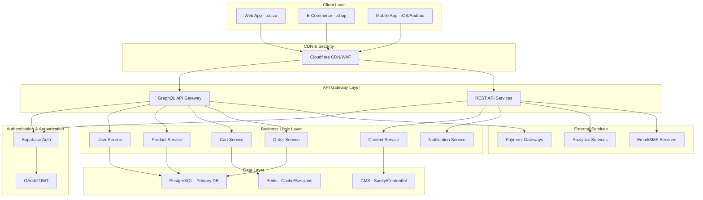
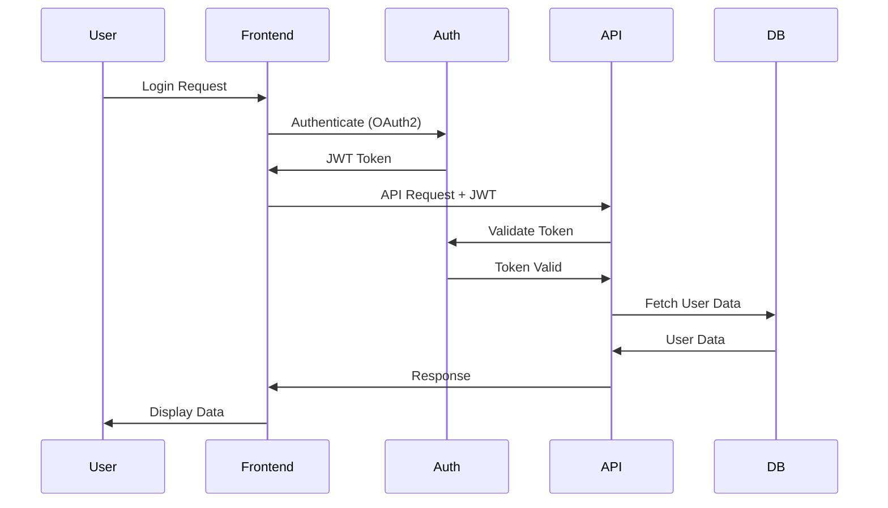
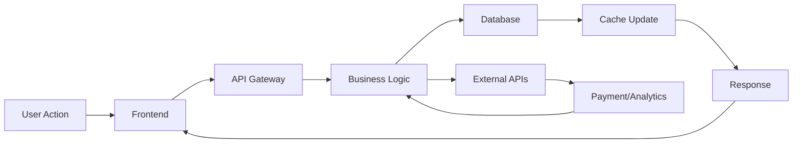
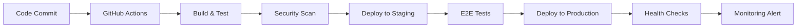

# Better Being - Technical Architecture Document

## Document Information

**Project:** Better Being Ecosystem  
**Document Type:** Technical Architecture Document (TAD)  
**Version:** v4  
**Last Updated:** 2025-08-13  
**Architecture Type:** Brownfield Enhancement  

## 1. Executive Summary

Better Being is a unified digital wellness ecosystem consisting of three main platforms:
- **betterbeing.co.za**: Brand hub and wellness content platform
- **betterbeing.shop**: E-commerce platform for supplements and wellness products  
- **Mobile App (iOS/Android)**: Unified wellness experience with commerce integration

The architecture emphasizes unified user experience, scalable infrastructure, and security while maintaining performance across all touchpoints.

## 2. System Overview

### 2.1 High-Level Architecture



### 2.2 Technology Stack

#### Frontend Technologies
- **Framework:** React 18 with TypeScript
- **Build Tool:** Vite
- **UI Library:** shadcn/ui with Tailwind CSS
- **State Management:** TanStack Query (React Query) + Context API
- **Routing:** React Router DOM v6

#### Backend Technologies
- **Runtime:** Node.js 18+
- **Framework:** Express.js
- **Database:** PostgreSQL 15+
- **Cache:** Redis 7+
- **ORM:** Prisma or raw SQL with pg

#### Mobile Technologies
- **Primary:** React Native (recommended)
- **Alternative:** Flutter
- **State Management:** Redux Toolkit or Zustand
- **Navigation:** React Navigation v6

#### Infrastructure & DevOps
- **Hosting:** Vercel (frontend), Railway/Render (backend)
- **CDN/Security:** Cloudflare
- **CI/CD:** GitHub Actions
- **Monitoring:** Vercel Analytics, Sentry
- **Container:** Docker (optional)

## 3. System Components

### 3.1 Authentication & User Management

#### Authentication Flow


#### Implementation Details
- **Provider:** Supabase Auth or Auth0
- **Protocol:** OAuth2 with PKCE for mobile
- **Token Management:** JWT with refresh token rotation
- **Session Storage:** HTTP-only cookies for web, secure storage for mobile
- **Multi-factor Authentication:** SMS and authenticator app support

### 3.2 E-Commerce Architecture

#### Core E-Commerce Services

**Product Service**
- Product catalog management
- Search and filtering capabilities
- Inventory tracking
- Price management
- Category and tag organization

**Cart Service**
- Session-based and persistent cart
- Real-time cart synchronization
- Cart abandonment tracking
- Multi-device cart persistence

**Order Service**
- Order creation and management
- Order status tracking
- Order history and analytics
- Subscription management

**Payment Service**
- Multiple payment gateway integration
- Payment method management
- Transaction processing
- Refund and dispute handling

#### Database Schema (Key Tables)

```sql
-- Users table
CREATE TABLE users (
    id UUID PRIMARY KEY DEFAULT gen_random_uuid(),
    email VARCHAR(255) UNIQUE NOT NULL,
    first_name VARCHAR(100),
    last_name VARCHAR(100),
    phone VARCHAR(20),
    created_at TIMESTAMP DEFAULT NOW(),
    updated_at TIMESTAMP DEFAULT NOW()
);

-- Products table
CREATE TABLE products (
    id UUID PRIMARY KEY DEFAULT gen_random_uuid(),
    name VARCHAR(255) NOT NULL,
    description TEXT,
    price DECIMAL(10,2) NOT NULL,
    sku VARCHAR(100) UNIQUE,
    stock_quantity INTEGER DEFAULT 0,
    category_id UUID REFERENCES categories(id),
    is_active BOOLEAN DEFAULT TRUE,
    created_at TIMESTAMP DEFAULT NOW()
);

-- Cart table
CREATE TABLE carts (
    id UUID PRIMARY KEY DEFAULT gen_random_uuid(),
    user_id UUID REFERENCES users(id),
    session_id VARCHAR(255),
    created_at TIMESTAMP DEFAULT NOW(),
    updated_at TIMESTAMP DEFAULT NOW()
);

-- Orders table
CREATE TABLE orders (
    id UUID PRIMARY KEY DEFAULT gen_random_uuid(),
    user_id UUID REFERENCES users(id),
    total_amount DECIMAL(10,2) NOT NULL,
    status VARCHAR(50) DEFAULT 'pending',
    payment_status VARCHAR(50) DEFAULT 'pending',
    created_at TIMESTAMP DEFAULT NOW()
);
```

### 3.3 Content Management System

#### CMS Architecture
- **Headless CMS:** Sanity or Contentful
- **Content Types:** Articles, Products, Pages, Media
- **API Integration:** RESTful API with GraphQL support
- **Content Preview:** Real-time preview capabilities
- **SEO Management:** Meta tags, structured data, sitemaps

#### Content Delivery
- **Static Site Generation:** Pre-rendered content for performance
- **Incremental Static Regeneration:** On-demand content updates
- **Image Optimization:** Automatic image resizing and format optimization
- **CDN Distribution:** Global content delivery via Cloudflare

### 3.4 Mobile Application Architecture

#### Architecture Pattern
- **Pattern:** Clean Architecture with MVVM
- **State Management:** Redux Toolkit or Zustand
- **Navigation:** Stack and Tab navigation
- **Offline Support:** Local database with sync capabilities

#### Key Features
- **Authentication:** Biometric and PIN authentication
- **Push Notifications:** Firebase Cloud Messaging
- **Deep Linking:** Universal links and custom URL schemes
- **Analytics:** Custom event tracking
- **Performance:** Code splitting and lazy loading

## 4. Security Architecture

### 4.1 Security Layers

#### Network Security
- **CDN Protection:** Cloudflare WAF and DDoS protection
- **SSL/TLS:** End-to-end encryption with TLS 1.3
- **DNSSEC:** DNS security extensions
- **Rate Limiting:** API and endpoint rate limiting

#### Application Security
- **Authentication:** Multi-factor authentication support
- **Authorization:** Role-based access control (RBAC)
- **Input Validation:** Comprehensive input sanitization
- **Output Encoding:** XSS prevention
- **CSRF Protection:** Cross-site request forgery prevention

#### Data Security
- **Encryption at Rest:** Database and file encryption
- **Encryption in Transit:** All communication encrypted
- **Data Classification:** Sensitive data identification
- **Backup Security:** Encrypted backup storage
- **Privacy Compliance:** GDPR and POPI Act compliance

### 4.2 Security Checklist

- [ ] HTTPS enforced across all domains
- [ ] Content Security Policy (CSP) implemented
- [ ] SQL injection prevention measures
- [ ] XSS protection enabled
- [ ] CSRF tokens implemented
- [ ] Rate limiting configured
- [ ] Input validation on all endpoints
- [ ] Secure cookie settings
- [ ] Password hashing with bcrypt/scrypt
- [ ] Regular security audits scheduled

## 5. Performance & Scalability

### 5.1 Performance Optimization

#### Frontend Performance
- **Code Splitting:** Route-based and component-based splitting
- **Lazy Loading:** Images and components loaded on demand
- **Bundle Optimization:** Tree shaking and dead code elimination
- **Caching Strategy:** Browser and CDN caching
- **Image Optimization:** WebP format and responsive images

#### Backend Performance
- **Database Optimization:** Query optimization and indexing
- **Caching Layer:** Redis for session and data caching
- **Connection Pooling:** Database connection management
- **API Optimization:** GraphQL query optimization
- **Background Jobs:** Queue-based processing for heavy operations

### 5.2 Scalability Strategy

#### Horizontal Scaling
- **Load Balancing:** Application load balancer configuration
- **Database Sharding:** Horizontal database partitioning
- **Microservices:** Service-oriented architecture migration path
- **Auto-scaling:** Cloud provider auto-scaling configuration

#### Vertical Scaling
- **Resource Monitoring:** CPU, memory, and disk monitoring
- **Performance Profiling:** Application performance monitoring
- **Database Tuning:** Query and schema optimization
- **Caching Optimization:** Multi-level caching strategy

## 6. Data Architecture

### 6.1 Database Design

#### Primary Database (PostgreSQL)
- **User Data:** Authentication, profiles, preferences
- **E-commerce Data:** Products, orders, payments
- **Analytics Data:** User behavior, conversion metrics
- **System Data:** Configurations, logs, audit trails

#### Caching Layer (Redis)
- **Session Storage:** User session data
- **Cart Data:** Shopping cart persistence
- **Temporary Data:** OTP codes, tokens
- **API Caching:** Frequently accessed API responses

#### Content Storage (CMS)
- **Content Data:** Articles, pages, media
- **Metadata:** SEO data, categorization
- **Versioning:** Content history and rollback
- **Assets:** Images, documents, videos

### 6.2 Data Flow



## 7. Integration Architecture

### 7.1 Payment Integration

#### South African Payment Gateways
- **PayFast:** Primary payment processor
- **Zapper:** QR code and mobile payments
- **PayJustNow:** Buy now, pay later
- **Peach Payments:** Alternative processor

#### Payment Flow
1. User initiates payment
2. Payment data encrypted and sent to gateway
3. Gateway processes payment
4. Webhook receives payment confirmation
5. Order status updated
6. User receives confirmation

### 7.2 Analytics Integration

#### Analytics Stack
- **Google Analytics 4:** Web analytics and e-commerce tracking
- **Segment:** Customer data platform
- **Mixpanel:** Product analytics and user behavior
- **Hotjar:** User experience analytics

#### Event Tracking
- **E-commerce Events:** Purchase, cart actions, checkout steps
- **User Events:** Registration, login, profile updates
- **Content Events:** Page views, article reads, search queries
- **Custom Events:** Business-specific metrics

### 7.3 AI Integration

#### MiniMax API Integration
- **Provider:** MiniMax (https://www.minimax.com/)
- **Models:** MiniMax-M1, MiniMax-Text-01
- **Use Cases:** Chatbots, content generation, product recommendations
- **Integration:** Custom service layer with streaming support

#### AI Features
- **Chat Interface:** Real-time customer support chat
- **Content Generation:** Product descriptions, blog posts
- **Personalization:** Product recommendations based on user behavior
- **Search Enhancement:** Semantic search capabilities

#### Implementation Details
- **Service Layer:** Custom MiniMax service with TypeScript types
- **React Hooks:** useMiniMaxChat hook for component integration
- **Streaming Support:** Real-time response streaming for better UX
- **Error Handling:** Comprehensive error handling and retry logic

## 8. Development Architecture

### 8.1 Project Structure

```
BetterBeingWEB/
├── .bmad-core/              # BMad framework configuration
├── docs/                    # Project documentation
│   ├── prd.md              # Product requirements
│   ├── architecture.md     # This document
│   ├── prd/               # Sharded PRD documents
│   └── architecture/      # Sharded architecture documents
├── src/                    # Frontend source code
│   ├── components/        # React components
│   ├── pages/            # Page components
│   ├── hooks/            # Custom hooks
│   ├── services/         # API services
│   └── styles/           # Styling files
├── server/                 # Backend source code
│   ├── src/              # Server source
│   ├── routes/           # API routes
│   ├── middleware/       # Express middleware
│   └── config/           # Configuration files
├── mobile/                 # Mobile app (if separate repo)
└── .ai/                   # AI development tools
```

### 8.2 Development Standards

#### Code Quality
- **TypeScript:** Strict mode enabled
- **ESLint:** Airbnb configuration with custom rules
- **Prettier:** Consistent code formatting
- **Husky:** Pre-commit hooks for quality checks
- **Jest/Vitest:** Unit and integration testing

#### Git Workflow
- **Branching Strategy:** GitFlow with feature branches
- **Commit Convention:** Conventional commits
- **Pull Request Process:** Code review and testing required
- **CI/CD Pipeline:** Automated testing and deployment

## 9. Deployment Architecture

### 9.1 Environment Strategy

#### Development Environment
- **Local Development:** Docker Compose setup
- **Database:** Local PostgreSQL and Redis
- **Hot Reload:** Development server with hot reload
- **Mock Services:** Local API mocking

#### Staging Environment
- **Infrastructure:** Production-like environment
- **Database:** Staging database with production schema
- **Testing:** End-to-end testing environment
- **Integration:** Third-party service integration testing

#### Production Environment
- **Frontend:** Vercel deployment
- **Backend:** Railway/Render deployment
- **Database:** Managed PostgreSQL service
- **Monitoring:** Full observability stack

### 9.2 CI/CD Pipeline



## 10. Monitoring & Observability

### 10.1 Application Monitoring

#### Frontend Monitoring
- **Performance:** Core Web Vitals tracking
- **Errors:** JavaScript error tracking
- **User Analytics:** User behavior analysis
- **Uptime:** Synthetic monitoring

#### Backend Monitoring
- **API Performance:** Response time and throughput
- **Database Performance:** Query performance and connections
- **System Metrics:** CPU, memory, disk usage
- **Business Metrics:** Conversion rates, revenue tracking

### 10.2 Alerting Strategy

#### Critical Alerts
- **System Down:** 5xx errors above threshold
- **Performance:** Response time above 5 seconds
- **Security:** Suspicious activity detection
- **Business:** Revenue drop or conversion issues

#### Alert Channels
- **Slack:** Development team notifications
- **Email:** Management and stakeholder alerts
- **SMS:** Critical production issues
- **PagerDuty:** On-call engineer rotation

## 11. Architecture Decision Records (ADRs)

### ADR-001: Frontend Framework Selection
- **Decision:** React 18 with TypeScript
- **Rationale:** Team expertise, ecosystem, performance
- **Status:** Accepted

### ADR-002: Backend Technology
- **Decision:** Node.js with Express
- **Rationale:** JavaScript uniformity, rapid development
- **Status:** Accepted

### ADR-003: Database Choice
- **Decision:** PostgreSQL as primary database
- **Rationale:** ACID compliance, JSON support, scalability
- **Status:** Accepted

### ADR-004: Authentication Provider
- **Decision:** Supabase Auth
- **Rationale:** Built-in features, PostgreSQL integration
- **Status:** Under Review

### ADR-005: Deployment Platform
- **Decision:** Vercel for frontend, Railway for backend
- **Rationale:** Developer experience, cost-effectiveness
- **Status:** Accepted

## 12. Migration Strategy

### 12.1 Current State Analysis
- **Existing Assets:** React application with basic e-commerce structure
- **Technical Debt:** Incomplete backend integration
- **Data Migration:** Product catalog and user data
- **Feature Gaps:** Authentication, payment processing

### 12.2 Migration Phases

#### Phase 1: Foundation (Weeks 1-4)
- Complete authentication system
- Establish API structure
- Database migration and setup
- Basic security implementation

#### Phase 2: Core Features (Weeks 5-8)
- Shopping cart functionality
- Payment gateway integration
- Order management system
- User profile management

#### Phase 3: Advanced Features (Weeks 9-12)
- Content management system integration
- Mobile app development
- Analytics implementation
- Performance optimization

#### Phase 4: Launch Preparation (Weeks 13-16)
- Security audit and testing
- Performance testing and optimization
- Documentation completion
- Training and support setup

## 13. Risk Assessment & Mitigation

### 13.1 Technical Risks

| Risk | Probability | Impact | Mitigation |
|------|-------------|---------|------------|
| Database performance issues | Medium | High | Query optimization, caching, monitoring |
| Authentication system failures | Low | High | Backup auth provider, comprehensive testing |
| Payment gateway downtime | Medium | High | Multiple payment providers, fallback options |
| Security vulnerabilities | Medium | High | Regular audits, security testing, updates |
| Scalability bottlenecks | High | Medium | Performance monitoring, auto-scaling |

### 13.2 Business Risks

| Risk | Probability | Impact | Mitigation |
|------|-------------|---------|------------|
| Low user adoption | Medium | High | User testing, feedback loops, marketing |
| Competitor advantage | Medium | Medium | Feature differentiation, rapid iteration |
| Regulatory compliance | Low | High | Legal review, compliance frameworks |
| Technical team availability | Medium | Medium | Documentation, knowledge sharing |

## 14. Future Considerations

### 14.1 Technology Evolution
- **Frontend Frameworks:** React Server Components adoption
- **Backend Architecture:** Microservices migration path
- **Database:** Multi-region deployment consideration
- **Mobile:** Cross-platform framework evaluation

### 14.2 Feature Roadmap
- **AI Integration:** Personalization and recommendations
- **IoT Integration:** Wearable device connectivity
- **Blockchain:** Loyalty program tokenization
- **AR/VR:** Virtual product experiences

## 15. Conclusion

This architecture document provides a comprehensive technical foundation for the Better Being ecosystem. The architecture balances immediate needs with future scalability, emphasizing security, performance, and user experience across all platforms.

The modular design allows for incremental development and deployment while maintaining system integrity and user experience consistency. Regular reviews and updates of this architecture will ensure continued alignment with business objectives and technical evolution.

---

*This architecture document will be updated as the system evolves and new requirements emerge.*