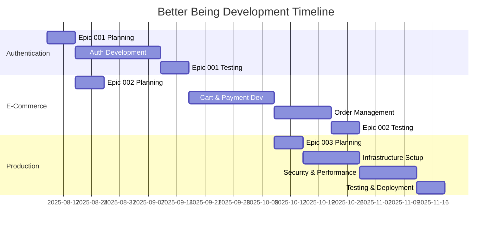

# Better Being Epic Roadmap & Implementation Strategy

## Executive Summary

**Document Version:** 1.0  
**Created:** 2025-08-13  
**Project:** Better Being Ecosystem Development  
**Framework:** BMad Method Brownfield Enhancement  

This document provides a comprehensive roadmap for transforming the Better Being platform from its current state into a production-ready, enterprise-grade wellness e-commerce ecosystem.

## Current State Assessment

### ✅ Completed Foundation
- **Frontend Architecture**: Modern React 18 + TypeScript + Vite setup
- **UI Framework**: shadcn/ui component library with Tailwind CSS
- **Basic E-commerce**: Product catalog, cart context, routing structure
- **Partial Backend**: Express server with basic authentication endpoints
- **Documentation**: Complete PRD and technical architecture documentation
- **BMad Integration**: Full framework setup with agents and workflows

### ⚠️ Critical Gaps Requiring Immediate Attention
- **Authentication Integration**: Frontend forms not connected to backend services
- **Payment Processing**: No payment gateway integration
- **Cart Persistence**: Shopping cart doesn't persist across sessions
- **Order Management**: No order processing or tracking system
- **Production Readiness**: Missing error handling, monitoring, security hardening

## Epic Roadmap Overview

### 🎯 Epic 001: Authentication System Integration
**Status:** Ready for Development | **Priority:** Critical | **Duration:** 3-4 Sprints

**Business Impact:** Enables personalized user experiences and foundational e-commerce functionality

**Key Deliverables:**
- Complete user registration and login system
- JWT-based authentication with session management
- Password recovery and user profile management
- Social login integration (Google, Facebook)
- Multi-factor authentication for enhanced security
- Cross-platform authentication (web and future mobile)

**Dependencies:** None - Can start immediately
**Risk Level:** Low - Well-defined requirements with existing backend foundation

---

### 🛒 Epic 002: E-Commerce Core Completion  
**Status:** Ready for Development | **Priority:** High | **Duration:** 4-5 Sprints

**Business Impact:** Enables complete purchase workflow and revenue generation

**Key Deliverables:**
- Shopping cart backend integration with persistence
- Multi-gateway payment processing (PayFast, Zapper, PayJustNow)
- Complete order management system with tracking
- Real-time inventory management
- Streamlined checkout experience
- Order confirmation and receipt system

**Dependencies:** Epic 001 (Authentication) must be 70% complete
**Risk Level:** Medium - Payment integration complexity and multiple gateway coordination

---

### 🚀 Epic 003: Production Readiness & Platform Stability
**Status:** Ready for Development | **Priority:** High | **Duration:** 3-4 Sprints

**Business Impact:** Ensures enterprise-grade reliability, security, and performance

**Key Deliverables:**
- Comprehensive error handling and recovery systems
- Real-time monitoring and alerting infrastructure
- Enterprise security hardening and compliance
- Performance optimization achieving Core Web Vitals targets
- Comprehensive testing framework (unit, integration, E2E)
- Automated deployment pipeline with zero-downtime releases

**Dependencies:** Epic 001 and Epic 002 must be 80% complete
**Risk Level:** Medium - Infrastructure complexity and security requirements

## Implementation Timeline

### 🗓️ Quarter Overview (12-16 Weeks Total)

### Phase 1: Foundation (Weeks 1-5)
**Focus:** Authentication System Integration
- **Week 1:** Sprint planning and architecture review
- **Weeks 2-4:** Core authentication development
- **Week 5:** Testing, security review, and deployment

**Key Milestones:**
- [ ] User registration and login functional
- [ ] JWT authentication working across frontend/backend
- [ ] Password recovery system operational
- [ ] Basic user profile management complete

### Phase 2: E-Commerce Core (Weeks 6-10)
**Focus:** Complete Shopping and Payment Experience
- **Week 6:** Sprint planning and payment gateway setup
- **Weeks 7-8:** Cart persistence and payment integration
- **Weeks 9-10:** Order management and checkout optimization

**Key Milestones:**
- [ ] Shopping cart persists across sessions
- [ ] Payment gateways integrated and tested
- [ ] Order processing workflow complete
- [ ] Customer order tracking functional

### Phase 3: Production Readiness (Weeks 11-16)
**Focus:** Enterprise-Grade Platform Stability
- **Weeks 11-12:** Error handling and monitoring setup
- **Weeks 13-14:** Security hardening and performance optimization
- **Weeks 15-16:** Testing framework and deployment automation

**Key Milestones:**
- [ ] Comprehensive error handling operational
- [ ] Real-time monitoring and alerting active
- [ ] Security audit passed with compliance verification
- [ ] Automated testing and deployment pipeline functional

## Resource Allocation & Team Structure

### 👥 Core Development Team
- **Product Owner (Sarah)** - Requirements, prioritization, stakeholder communication
- **Senior Full-Stack Developer** - Primary development lead across all epics
- **DevOps Engineer** - Infrastructure, deployment, monitoring (Epic 003 focus)
- **QA Engineer** - Testing strategy, automation, quality assurance
- **Security Specialist** - Security review, compliance, audit (Epic 003 focus)

### 🎯 Specialized Roles (As Needed)
- **Payment Integration Specialist** - Epic 002 payment gateway implementation
- **Performance Engineer** - Epic 003 optimization and monitoring
- **UI/UX Designer** - Checkout flow and user experience optimization

## Risk Assessment & Mitigation Strategies

### 🔴 High-Priority Risks

| Risk | Impact | Probability | Epic | Mitigation Strategy |
|------|--------|-------------|------|-------------------|
| Payment gateway integration delays | High | Medium | 002 | Start integration early, have backup gateways ready |
| Security vulnerabilities discovered | High | Low | 001,003 | Regular security audits, penetration testing |
| Performance degradation under load | Medium | Medium | 003 | Load testing, performance monitoring baseline |
| Authentication system security issues | High | Low | 001 | Security review, MFA implementation |

### 🟡 Medium-Priority Risks

| Risk | Impact | Probability | Epic | Mitigation Strategy |
|------|--------|-------------|------|-------------------|
| Database performance issues | Medium | Medium | 002,003 | Query optimization, caching strategy |
| Third-party service downtime | Medium | Medium | All | Graceful degradation, backup services |
| Testing automation complexity | Medium | Low | 003 | Phased implementation, team training |
| Cross-browser compatibility issues | Low | Medium | All | Regular testing, progressive enhancement |

## Success Metrics & KPIs

### 🎯 Business Success Metrics

**Revenue & Conversion**
- Cart abandonment rate: Target < 25% (Industry average: 70%)
- Checkout completion rate: Target > 85%
- Average order value increase: Target +20%
- Customer acquisition cost reduction: Target -15%

**User Experience**
- Page load time: Target < 3 seconds
- Mobile conversion rate: Target > 3%
- Customer satisfaction score: Target > 4.5/5
- Support ticket volume: Target < 5% of users

### ⚡ Technical Success Metrics

**Performance**
- Core Web Vitals: All metrics in "Good" range
- API response time: 95th percentile < 500ms
- System uptime: Target > 99.9%
- Database query performance: 95th percentile < 100ms

**Security & Quality**
- Security vulnerabilities: Zero critical, < 5 medium
- Test coverage: > 80% for critical paths
- Deployment success rate: > 99%
- Mean time to recovery: < 30 minutes

## Budget & Resource Planning

### 💰 Estimated Development Investment

**Phase 1: Authentication (5 weeks)**
- Development: 200 hours
- QA Testing: 40 hours
- Security Review: 20 hours
- **Total: 260 hours**

**Phase 2: E-Commerce (5 weeks)**
- Development: 300 hours
- Payment Integration: 60 hours
- QA Testing: 60 hours
- **Total: 420 hours**

**Phase 3: Production (6 weeks)**
- Infrastructure: 120 hours
- Security Hardening: 80 hours
- Testing Framework: 100 hours
- DevOps Setup: 80 hours
- **Total: 380 hours**

**Grand Total: ~1,060 development hours**

### 🛠️ Infrastructure & Tooling Costs

**Monthly Operational Costs:**
- Hosting & Infrastructure: $200-400/month
- Monitoring & Analytics: $100-200/month
- Security Services: $150-300/month
- Payment Gateway Fees: 2.9% + $0.30 per transaction
- **Estimated Monthly OpEx: $450-900**

## Quality Assurance Strategy

### 🧪 Testing Approach

**Phase-Based Testing:**
1. **Unit Testing:** 80% coverage for business logic
2. **Integration Testing:** 100% API endpoint coverage
3. **End-to-End Testing:** Critical user journey coverage
4. **Security Testing:** Automated vulnerability scanning
5. **Performance Testing:** Load and stress testing
6. **User Acceptance Testing:** Stakeholder validation

### 📋 Quality Gates

**Epic 001 Quality Gates:**
- [ ] Authentication security audit passed
- [ ] Cross-browser compatibility verified
- [ ] Performance benchmarks met
- [ ] User acceptance testing completed

**Epic 002 Quality Gates:**
- [ ] Payment processing security verified
- [ ] PCI DSS compliance assessment passed
- [ ] Load testing under expected traffic completed
- [ ] Business stakeholder approval received

**Epic 003 Quality Gates:**
- [ ] Infrastructure security audit passed
- [ ] Performance targets achieved
- [ ] Disaster recovery procedures tested
- [ ] Compliance requirements verified

## Communication & Reporting

### 📊 Weekly Progress Reports
- Epic completion percentage
- Key milestone achievements
- Risk status updates
- Resource utilization metrics
- Next week priorities

### 🎯 Stakeholder Communication
- **Weekly:** Development team standup and progress review
- **Bi-weekly:** Business stakeholder demo and feedback session
- **Monthly:** Executive summary and strategic alignment review
- **Ad-hoc:** Critical issue escalation and resolution updates

## Deployment Strategy

### 🚀 Phased Rollout Approach

**Phase 1: Staging Deployment**
- Complete feature testing in production-like environment
- User acceptance testing with select stakeholders
- Performance and security validation

**Phase 2: Beta Release**
- Limited user group (10-20% of traffic)
- Real-world testing with actual customers
- Monitoring and feedback collection

**Phase 3: Full Production**
- Gradual traffic increase (25%, 50%, 75%, 100%)
- Continuous monitoring and performance tracking
- Immediate rollback capability maintained

### 📈 Post-Launch Optimization

**Week 1-2 Post-Launch:**
- Intensive monitoring and issue resolution
- User feedback collection and analysis
- Performance optimization based on real traffic

**Month 1 Post-Launch:**
- Comprehensive performance review
- User behavior analysis and optimization opportunities
- Planning for next phase enhancements

---

## Conclusion

This comprehensive roadmap provides a structured approach to transforming the Better Being platform into a production-ready, enterprise-grade e-commerce ecosystem. The BMad Method framework ensures systematic development with proper quality gates, risk mitigation, and stakeholder alignment.

**Immediate Next Steps:**
1. **Stakeholder approval** of this roadmap and resource allocation
2. **Epic 001 sprint planning** and team assignment
3. **Infrastructure setup** for development and staging environments
4. **Kick-off meeting** with all team members and role assignments

**Success Factors:**
- Adherence to BMad Method workflows and quality standards
- Regular stakeholder communication and feedback incorporation
- Proactive risk management and mitigation
- Continuous testing and quality assurance throughout development

The platform will be positioned for sustainable growth, customer satisfaction, and business success upon completion of all three epics.

---

**Document Owner:** Product Owner (Sarah)  
**Review Cycle:** Weekly during active development  
**Approval Required:** Business Stakeholders, Technical Lead, Security Architect  
**Next Review Date:** 2025-08-20